# 🚗 Speedy Car Metrics

---
## 📊 Speedy Cars Data Analysis: Enhancing Insights for a Rental  Business

---
## 🔎 Project Overview:-

The **Speedy Cars Database Analysis** project utilizes **SQL** to explore key aspects of a car rental business, including car availability, customer behavior, employee performance, and revenue trends. By analyzing tables such as **Cars, Customers, Rentals, Payments,** and **Employees**, the project extracts valuable insights through **23 business-critical queries**. It helps optimize **fleet management, revenue generation, and customer retention** by identifying high-demand cars, top-paying customers, and branch-wise performance. Additionally, it evaluates **rental duration patterns, employee efficiency, and payment trends** to enhance operational decision-making. This data-driven approach empowers **Speedy Cars** to improve profitability, streamline operations, and enhance customer experience. 🚗📊

---

## 📌 Project Objectives: Speedy Cars Database Analysis

The objective of this project is to analyze the **Speedy Cars** rental database using **SQL** to extract meaningful insights that can help optimize business operations. The analysis aims to:  

1️⃣ **Monitor car availability** to ensure efficient fleet management.  
2️⃣**Track employee performance** based on the number of rentals processed.  
3️⃣ **Analyze customer behavior** to identify frequent renters and high-value customers.  
4️⃣ **Evaluate rental revenue trends** across different branches and payment methods.  
5️⃣ **Identify top-performing cars** based on rental frequency and revenue generation.  
6️⃣ **Detect inactive customers** to improve customer retention strategies.  

This data-driven approach enables **Speedy Cars** to improve decision-making, enhance operational efficiency, and boost profitability. 🚗💨

---
# 🛠️ Tools & Library Used
 &nbsp;

# Project Result

[Click here to get full code](https://github.com/Omgadakhgithub/Speedy-Car-Metrics/blob/main/Speedy%20Cars.sql)

---
# 🎯 Query Task 

1. **List all cars that are currently available for rent?**

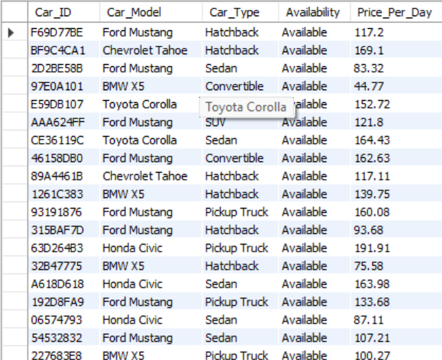 &nbsp;

---
2. **Show employees working in the 'Los Angeles' branch?**

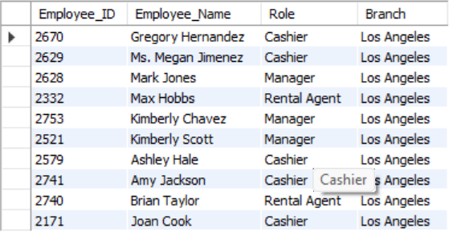 &nbsp;

---
3. **Count the total number of rentals per branch?**

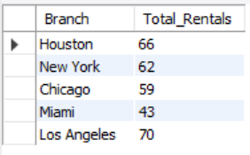 &nbsp;

---
4. **Find the average rental amount paid per transaction?**  

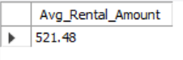 &nbsp;

---
5. **Show the total revenue generated by each rental branch?**  

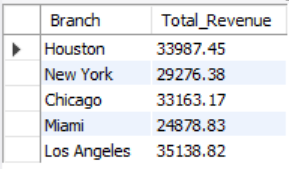 &nbsp;

---
6. **Find the most rented car model?**  

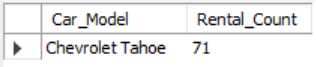 &nbsp;

---
7. **Get the total number of customers?**

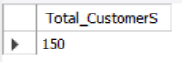 &nbsp;

---
8. **Get a list of employees who have processed more than 5 rentals?**  

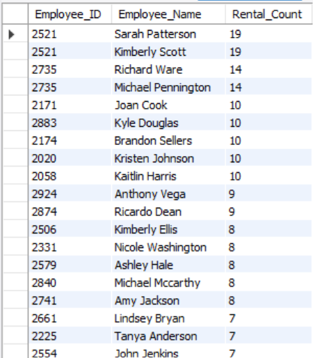 &nbsp;

---
9. **Find which customers have rented cars more than 3 times?**  

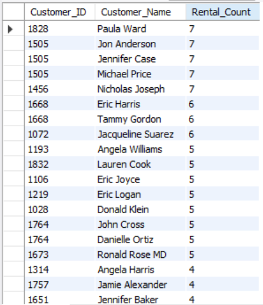 &nbsp;

---
10. **Show rental details with car models and prices?**  

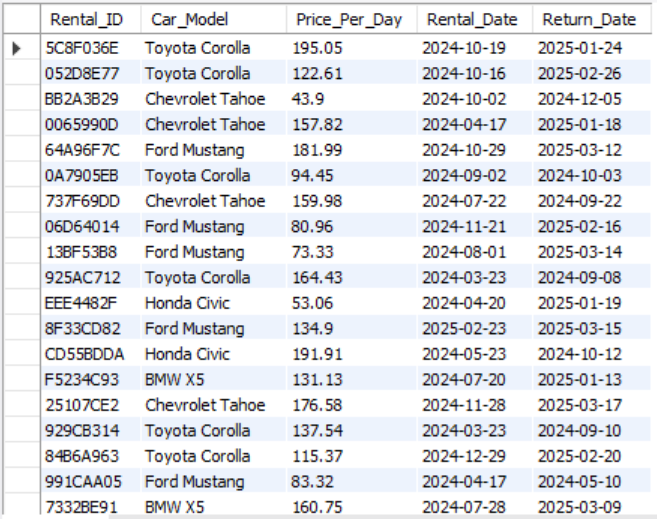 &nbsp;

---
11. **Find the top 5 highest-paying customers?**  

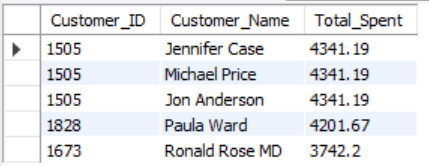 &nbsp;

---
12. **Show the monthly revenue for the past 6 months?**  

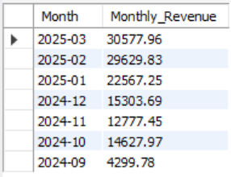 &nbsp;

---
13. **Find customers who have never rented a car?**  

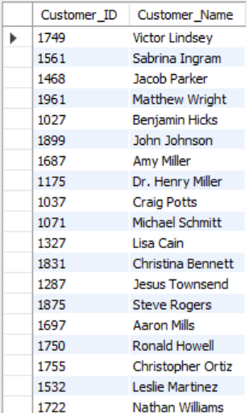 &nbsp;

---
14. **Get the most active employee (who handled the most rentals)?**  

 &nbsp;

---
15. **Find cars that have been rented at least 5 times?**  

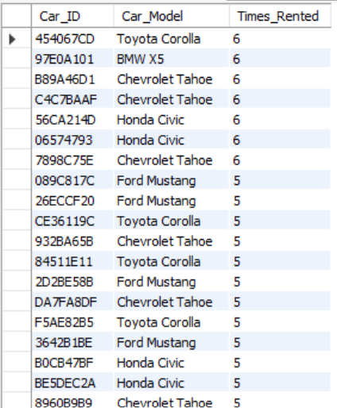 &nbsp;

---
16. **Which customers have rented the most expensive car available?**  

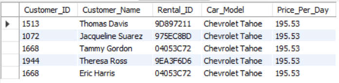 &nbsp;

---
17. **How do employees rank based on total rental revenue they handled?**  

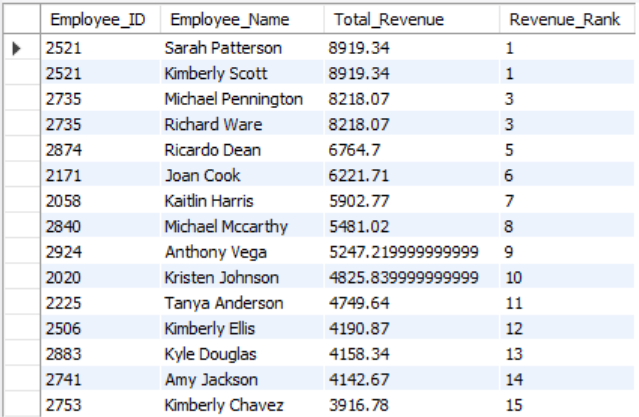 &nbsp;

---
18. **Which cars were rented for the longest duration?**  

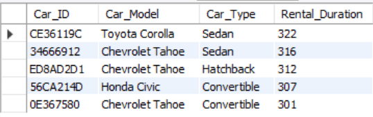 &nbsp;

---
19. **Which branches have generated above-average rental revenue?**  

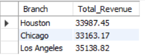 &nbsp;

---
20. **Which customers rented cars on consecutive days?**  

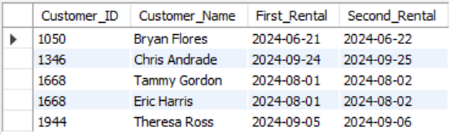 &nbsp;
