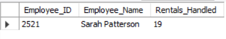

# Speedy-Car-Metrics
 

1. **List all cars that are currently available for rent?**

 &nbsp;

---
2. **Show employees working in the 'Los Angeles' branch?**

 &nbsp;

---
3. **Count the total number of rentals per branch?**

 &nbsp;

---
4. **Find the average rental amount paid per transaction?**  

 &nbsp;

---
5. **Show the total revenue generated by each rental branch?**  

 &nbsp;

---
6. **Find the most rented car model?**  

 &nbsp;

---
7. **Get the total number of customers?**

 &nbsp;

---
8. **Get a list of employees who have processed more than 5 rentals?**  

 &nbsp;

---
9. **Find which customers have rented cars more than 3 times?**  

 &nbsp;

---
10. **Show rental details with car models and prices?**  

 &nbsp;

---
11. **Find the top 5 highest-paying customers?**  

 &nbsp;

---
12. **Show the monthly revenue for the past 6 months?**  

 &nbsp;

---
13. **Find customers who have never rented a car?**  

 &nbsp;

---
14. **Get the most active employee (who handled the most rentals)?**  

 &nbsp;

---
15. **Find cars that have been rented at least 5 times?**  

 &nbsp;

---
16. **Which customers have rented the most expensive car available?**  

 &nbsp;

---
17. **How do employees rank based on total rental revenue they handled?**  

 &nbsp;

---
18. **Which cars were rented for the longest duration?**  

 &nbsp;

---
19. **Which branches have generated above-average rental revenue?**  

 &nbsp;

---
20. **Which customers rented cars on consecutive days?**  

 &nbsp;
